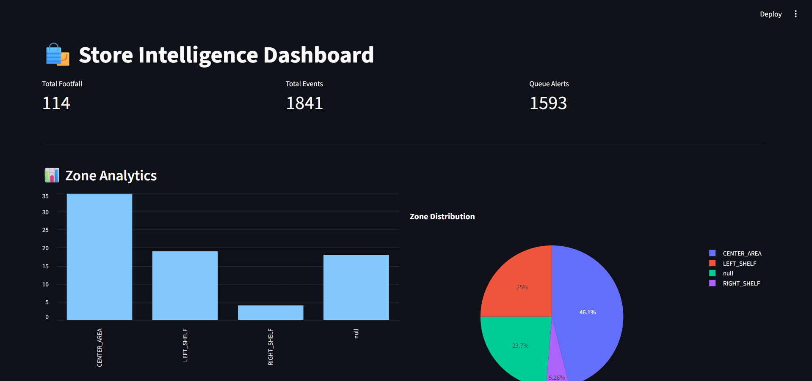
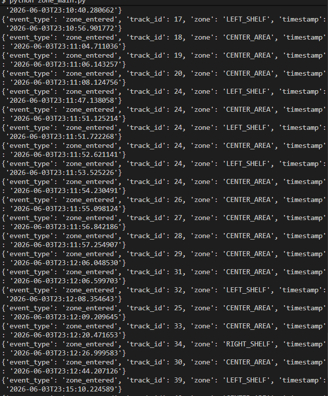

#  Store Intelligence System
### Purplle Tech Challenge 2026 – Round 2 Submission

## Overview

Store Intelligence System is an AI-powered retail analytics platform that processes CCTV footage from multiple store cameras and generates actionable business insights in real time.

The system uses Computer Vision, Object Tracking, Event Generation, Analytics APIs, and a Dashboard to monitor customer activity across the store.

---

## Problem Statement

Build an end-to-end Store Intelligence System using CCTV footage capable of:

- Customer Detection
- Customer Tracking
- Event Generation
- Zone Analytics
- Billing Analytics
- Queue Monitoring
- Real-Time Analytics APIs
- Dashboard Visualization

---

## Features

###  Customer Detection

Uses YOLOv8 to detect customers from CCTV footage.

###  Customer Tracking

Uses ByteTrack to maintain unique customer IDs across frames.

### Entry Analytics

Tracks customer entries into the store and generates entry events.

Example:

```json
{
  "event_type": "entry",
  "track_id": 12,
  "timestamp": "2026-06-02T22:17:45"
}
```

###  Zone Analytics

Tracks customer movement inside store zones.

Supported zones:

- LEFT_SHELF
- CENTER_AREA
- RIGHT_SHELF
- BILLING

Example:

```json
{
  "event_type": "zone_entered",
  "track_id": 12,
  "zone": "CENTER_AREA"
}
```

### 💳 Billing Analytics

Detects customers entering the billing area.

Example:

```json
{
  "event_type": "billing_entered",
  "track_id": 15
}
```

### 🚨 Queue Alerts

Generates alerts when billing queue size exceeds threshold.

Example:

```json
{
  "event_type": "queue_alert",
  "queue_size": 6
}
```

### 📊 Dashboard

Provides real-time analytics including:

- Total Footfall
- Zone Visits
- Queue Alerts
- Event Monitoring

---

## System Architecture

```text
CCTV Cameras
      │
      ▼
YOLOv8 Detection
      │
      ▼
ByteTrack Tracking
      │
      ▼
Event Engine
      │
 ┌────┼─────┬─────┐
 ▼    ▼     ▼     ▼
Entry Zone Billing Queue
      │
      ▼
events.jsonl
      │
      ▼
FastAPI Backend
      │
      ▼
Streamlit Dashboard
```

---

## Tech Stack

### AI / Computer Vision

- YOLOv8
- OpenCV
- ByteTrack

### Backend

- Python
- FastAPI

### Dashboard

- Streamlit
- Pandas

### Storage

- JSONL Event Store

---

## Folder Structure

```text
store-intelligence/
│
├── backend/
│   ├── api/
│   │   └── app.py
│   │
│   ├── db/
│   │
│   ├── services/
│   │   ├── detector.py
│   │   ├── tracker.py
│   │   ├── event_generator.py
│   │   ├── event_logger.py
│   │   ├── zones.py
│   │   └── zone_event_generator.py
│   │
│   ├── main.py
│   ├── zone_main.py
│   ├── billing_main.py
│   └── events.jsonl
│
├── dashboard.py
│
├── screenshots/
│
├── README.md
└── requirements.txt
```

---

## API Endpoints

### Get All Events

```http
GET /events
```

### Footfall Analytics

```http
GET /analytics/footfall
```

### Zone Analytics

```http
GET /analytics/zones
```

### Queue Alerts

```http
GET /alerts
```

Swagger Documentation:

```text
http://127.0.0.1:8000/docs
```

---

## Setup Instructions

### Clone Repository

```bash
git clone <repository_url>
cd store-intelligence
```

### Install Dependencies

```bash
pip install -r requirements.txt
```

### Start Backend

```bash
cd backend

uvicorn api.app:app --reload
```

### Start Dashboard

```bash
streamlit run dashboard.py
```

---

## Dashboard Preview

Add screenshots here:

### Dashboard



### Swagger API


### Zone Analytics



---

## Future Improvements

- Dwell Time Analytics
- Customer Journey Analysis
- Heatmaps
- Real-Time Streaming with Kafka
- Database Storage (PostgreSQL)
- Multi-Store Analytics
- Customer Re-identification Across Cameras

---

## Hackathon Submission

Purplle Tech Challenge 2026 – Round 2

AI-Powered Store Intelligence System using CCTV Analytics, Event Streaming, FastAPI, and Real-Time Dashboarding.